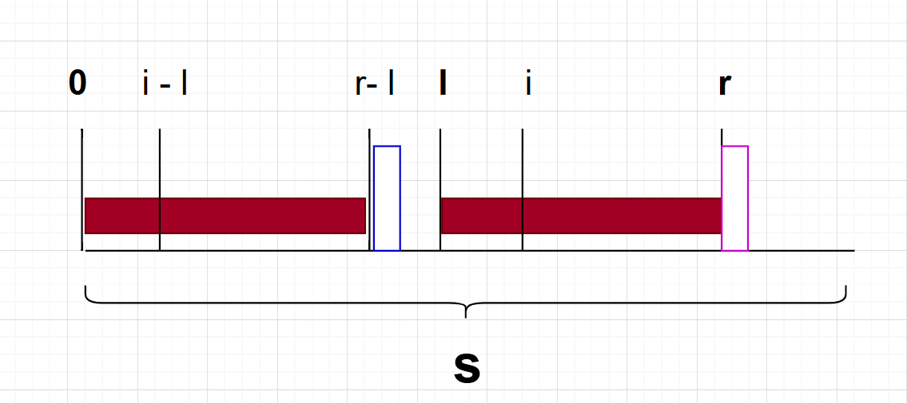
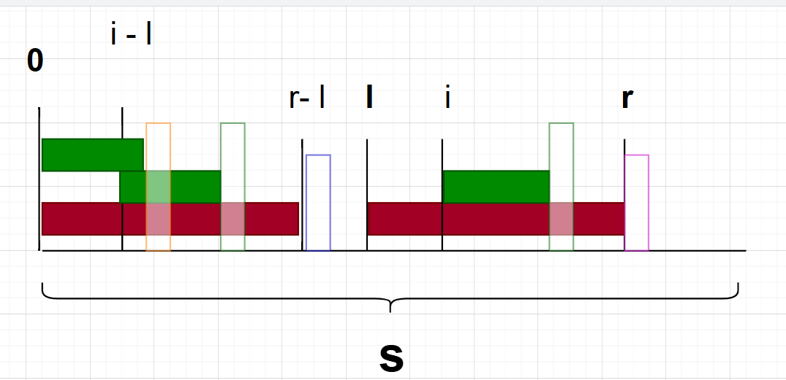
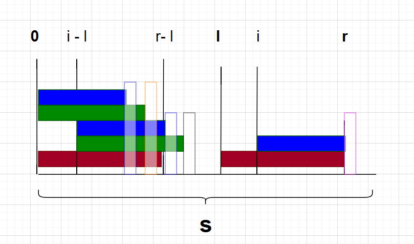

# 定义
z函数定义为:$z_i$为下标`i`开头的后缀与整个字符串的**LCP**

数组的获得也是类型KMP根据已经获得的LCP信息获取。

## 约定
为方便讲解，下面的图示和符号这里说明各自的意义。

图：

+ 相同颜色的区间表示完全一致 即字符串`s=t`

+ 透明方框代表**一个**字符，颜色相同表示一样

记`l,r`为已知最远的LCP区间的左右端点

`s`要获得z函数的字符串

`z`要求的z函数$z_i$下标`i`的z函数(下标i的后缀与字符串的LCP)

`i`要求的z函数的位置

那么红色区间长度为$z_l$

获得$z_{i - l}$的长度，获得绿色相同部分(位置不确定)

右端点为 $i - l + z_{i - l} - 1$

+ $i - l + z_{i - l} - 1 < r-l$的情况
  
  根据z函数以及相等的字符串的性质，获得i后缀与字符串的LCP，图里绿色字符和黄色字符是不相等的(z函数的，如果相等必然更长)。
  i后缀同理和字符串前缀也在绿色字符位置截断。
  所以$z_i = z_{i - l}$
<!-- + 的情况
  
  由于红色区间和z函数的性质得蓝色字符和自杀字符不同所以LCP被限制
  由于绿色区间的相等，得到蓝色字符如图， -->