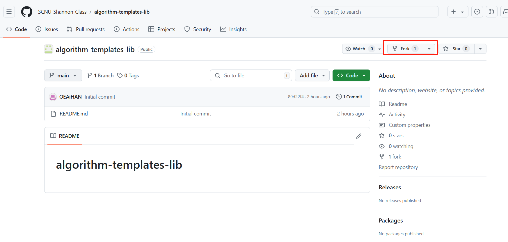

贡献项目应该 先fork到**个人仓库**

然后在**个人仓库**git clone (code随便选一个)到自己的本地文件里。然后设置该仓库的源方便更新：
```
git remote add (upstream 这里名字 自己喜欢)
```
然后可以`git remote -v`查看连接的源。

当修改后
可以`git add .`将已经修改的文件增加到本地仓库。 `git commit -m "提交信息"`提交到本地仓库。push前可以先`git pull upstream main`和`git pull origin main`查看是否冲突，没用冲突后`git push origin main`推送到个人github上，最后再发出合并请求 