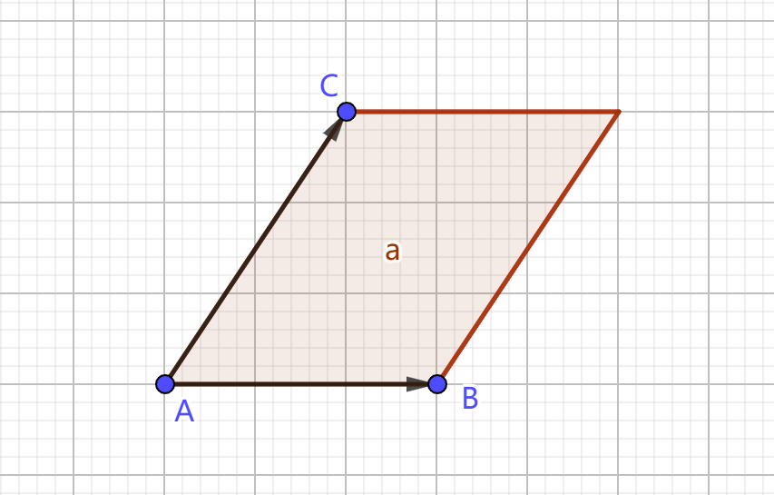

# 二维计算几何基础

### 点、向量基础操作

**点**和**向量**均使用 C++ STL 中的 pair 表示，按需求可将 `pair<long long int, long long int>` 完全改为 `pair<long double, long double>`。

重载运算符用于向量计算，**dot** 为向量点乘、**cross** 为向量叉乘。

```c++
#include <bits/stdc++.h>
#define LL long long
#define pll pair<LL, LL>
#define double long double
#define pdd pair<double, double>

pll operator + (pll l, pll r)
{
    return make_pair(l.first + r.first, l.second + r.second);
}

pll operator - (pll l, pll r)
{
    return make_pair(l.first - r.first, l.second - r.second);
}

LL dot(pll l, pll r)
{
    return l.first * r.first + l.second * r.second;
}

LL cross(pll l, pll r)
{
    return l.first * r.second - l.second * r.first;
}

double dis(pll v)
{
    return sqrt(dot(v, v));
}
```

对于输入点坐标均为整数的题目，大部分需求可通过点乘和叉乘实现而不经过浮点运算。

点乘的几何意义为：
$$
\vec{a} \cdot \vec{b} = |\vec{a}||\vec{b}|\cos{\theta}
$$
其中 $\theta$ 为向量 $\vec{a}, \vec{b}$ 的夹角，点乘因此常用于判断两向量夹角大小（判断改夹角为锐、直、钝角）、计算向量模长的平方（$\vec{a} \cdot \vec{a} = |a|^2 \cos{0}$）和**计算某条向量在另一条向量上的投影**。

叉乘的几何意义可表示为：两向量形成的平行四边形的有向面积。向量叉乘不满足交换律，有
$$
\vec{a} \times \vec{b} = -(\vec{b} \times \vec{a})
$$
将两条向量视为一个不大于 $\pi$ 的夹角的两条边，则按顺时针方向，在前的向量叉乘在后的向量得到的结果为正。



如图，平行四边形面积为 $S_a$，则有 $\overrightarrow{AC} \times \overrightarrow{AB} = -S_a$。由点乘和叉乘的性质便可得出上图点 $C$ 到直线 $AB$ 距离的平方为：
$$
\frac{(\overrightarrow{AB} \times \overrightarrow{AC})^2}{\overrightarrow{AB} \cdot \overrightarrow{AB}}
$$
部分运算过程可能爆精度（如题目给定坐标范围达到 $10^9$ 时），中间运算需要转化成更高精度的数据类型。

部分操作示例：

```c++
#define i128 __int128

//将向量逆时针旋转90度
pll v;
pll res = { -v.second, v.first };

//线段判交（线段AB和线段CD）
pll A, B;
pll C, D;
bool res = (i128)cross(A - C, D - C) * cross(B - C, D - C) < 0 && (i128)cross(C - A, B - A) * cross(D - A, B - A) < 0;

//点到另外两点构成直线的距离的平方（点C到直线AB距离）
pll A, B;
pll C;
LL res = (i128)cross(C - A, B - A) * cross(C - A, B - A) / dot(B - A);

//三点构成三角形面积
pll A, B, C;
LL cur = abs(cross(B - A, C - A));
string res = to_string(cur / 2) + (cur & 1 ? ".5" : ".0");

//多边形面积（在ps数组中按逆时针顺序存储多边形顶点）——利用向量叉乘会得到有向平行四边形面积的性质
pll ps[N];
int n;
LL cur = cross(ps[1], ps[n]);
for (int i = 2; i <= n; i++)
    cur += cross(ps[i], ps[i - 1]);
string res = to_string(cur / 2) + (cur & 1 ? ".5" : ".0");
```

### 直线的表示和有浮点极角排序

```c++
#include <bits/stdc++.h>
#define LL long long
#define pll pair<LL, LL>
#define double long double
#define pdd pair<double, double>

struct line
{
    pdd p, v;
    double ang;

    line(pdd p, pdd v)
    {
        this->p = p;
        this->v = v;
        this->ang = atan2(v.second, v.first);
    }

    bool operator < (const line& r)
    {
        return this->ang < r.ang;
    }

    pdd getIntersection(line l, line r)
    {
        pdd t = r.p + r.v;
        double s1 = cross(l.v, r.p - l.p), s2 = cross(l.v, t - l.p);
        return make_pair((r.p.first * s2 - t.first * s1) / (s2 - s1), (r.p.second * s2 - t.second * s1) / (s2 - s1));
    }
};
```

直线封装为结构体，用一个点和一个向量表示。`ang` 用于表示直线与坐标系 x 轴的夹角，`getIntersection` 函数用于求两直线交点，由于交点可能出现非整数坐标（即使表示直线的两点为整数坐标），直接用 `pair<long double, long double>` 作为返回值。进行极角排序时直接对存储直线的数组调用  STL 自带的 `sort` 函数即可。

直线多在求直线交点或半平面交中才会使用。